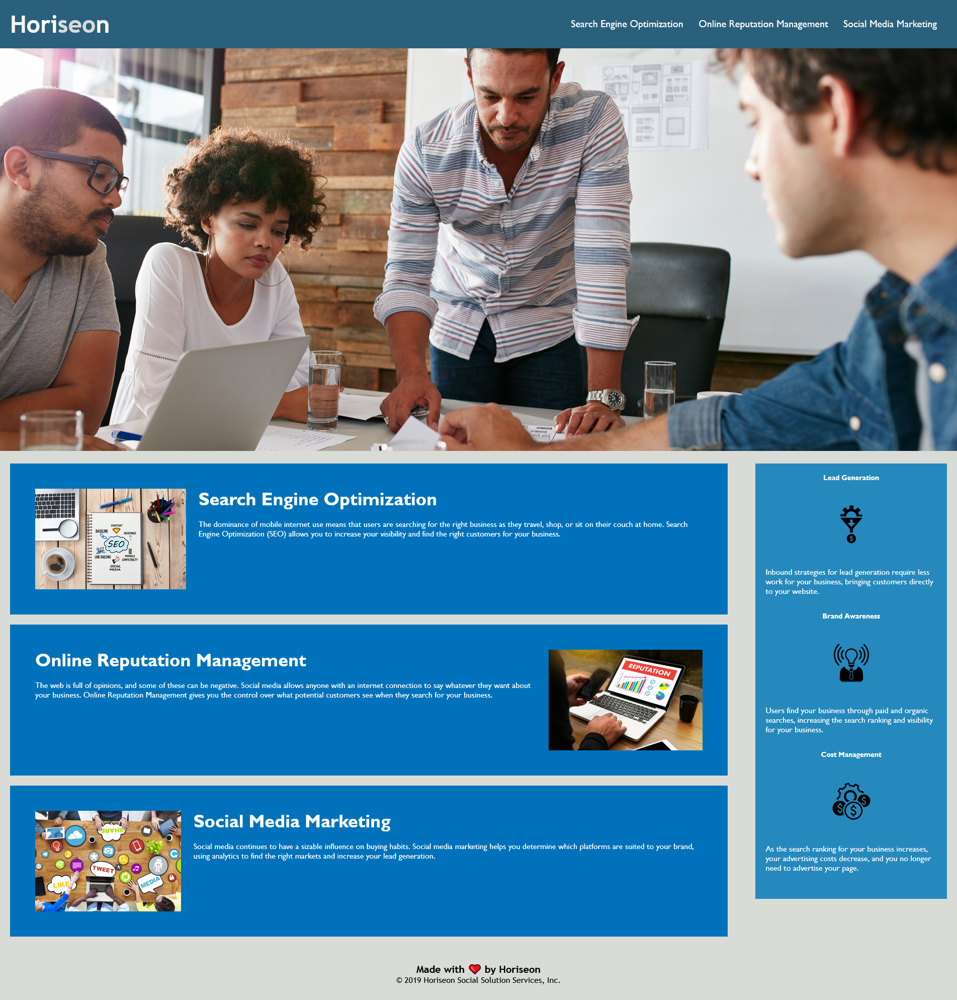

# Module 1 Challenge: Code Refactoring

[Link to the deployed application.](https://karlnh.github.io/module-1-challenge/)

## Description
The purpose of this project was to introduce myself to the basics of accessible design and coding. The project was framed as being part of an "on-the-job ticket" or feature request challenge: I began with starter code of a mockup website which lacked accessibility features and "refactored" it, or modified provided code with additional requested features. The challenge was to insert required accessibility features into the code without modifying the page's design. 

## Changes
Numerous changes were made to the document:
- The page was given stronger more relevant <title>; 
- Images were provided short alt-text descriptions for screen-readers;
- Various non-semantic elements were swapped out for more fitting semantic elements so developers could have a better idea of the page structure at a glance;
- Comment markers were added to both HTML and CSS for easier visual blocking of the code.

## Screenshots

## License
This repository and the files contained within are not for modification.

